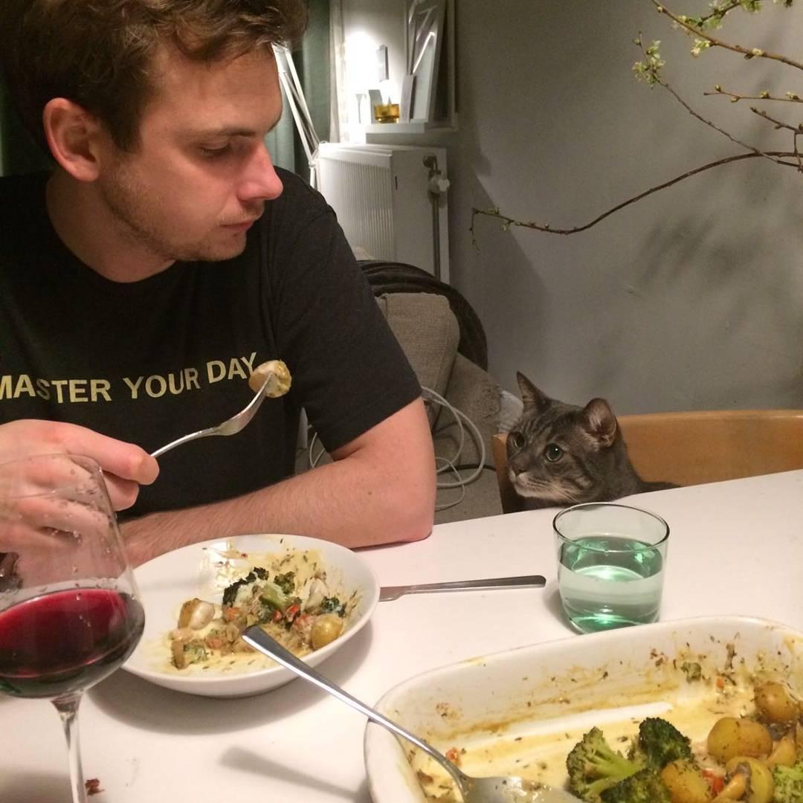

# Aardappel Broccoli Stoom Bakken

## Ingredienten

 - 500g vastkokende krieltjes
 - 1 grote ui, knoflook
 - 1 bakje kastagne champignons
 - 3 worteltjes van bos
 - 1 broccoli
 - 1 klein blikje kokosmelk
 - optioneel: cherry tomaatjes
 - optioneel: cachew nootjes
 - kruiden: paprika, kerrie, cayenne, oregano, tijm, rosemarijn

## Recept

1. Eerst aardappels en wortels stoombakken:

 - In hapjespan bodempje water, scheut olie en flinke snuf zeezout, goed roeren.
 - Aardappeltjes afspoelen en in de pan op middel/hoog vuur met deksel stoombakken.
 - Ondertussen worteltjes in stukjes erbij doen.
 - Eventueel scheutje water toevoegen als het droog kookt. Na ongeveer 20 of 25 min zijn aardappeltjes beetgaar. 
 
2. Onderstaande ingredienten toevoegen en dan paar minuten roerbakken:

 - Gesneden uien, evt knoflook toevoegen.
 - Naar smaak: paprika, cayenne, oregano, tijm, rosemarijn.
 - Paar minuten roerbakken.
 - Ondertussen broccoli appart beetgaar koken (7min).
 - Voeg champignons en evt nootjes toe, nog even roerbakken.

3. Saus is gezellig:

 - Mix 100ml kokosmelk met 2 eetlepels kerrie poeder, goed doorroeren.
 - Voeg toe aan aardappel schotel. Doorroeren en sudderen op laag vuurtje.
 - Voeg gekookte broccoli en evt tomaatjes toe. Voorzichtig door elkaar en verder sudderen.

Severen met visje of biefstuk.

